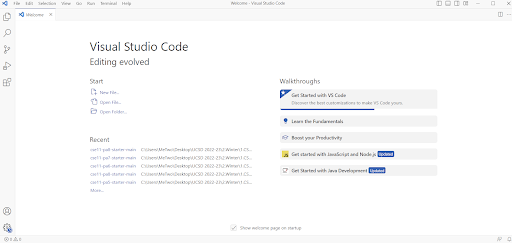
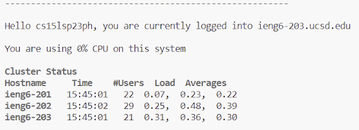
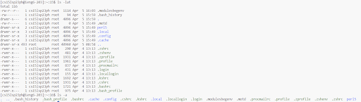

# Lab Report 1

## Step 1: Installing VScode

1. Visit this [link](https://code.visualstudio.com/) and download the corresponding file for your device to install VScode.
2. Upon completing the installation process for VScode, you should see a window similar to this.

3. VScode is now installed.


## Step 2: Remotely Connecting

Note 1: If you know your UCSD course-specific account for CSE 15L, start at step 3.
Note 2: In this step, code blocks ```like this``` will signify what is being typed and run on the remote server.
Note 3: If you do not have Git installed on your device, you can install [GitHub desktop](https://desktop.github.com/) as it is necessary for remotely connecting.
1. Visit this [link](https://sdacs.ucsd.edu/~icc/index.php) to find your UCSD course-specific account for CSE 15L.
2. Follow the instructions on the site in order to reset your password as you will need your username and password for remotely connecting.
3. Once you have your UCSD course-specific account details, open a terminal in VScode.  
4. Type this command in the terminal with the ```xx``` replaced with the letters in your account username.

``` ssh cs15lsp23xx@ieng6.ucsd.edu ```

5. If it is your first time remotely logging in onto your device, you will get a message asking if you want to continue connecting.  Then, type yes, press enter, and enter your password.  Your terminal is now remotely connected.
6. Look at the image below to see what a sucessful remote connection looks like.


## Step 3: Trying Some Commands

1. Type some of the following commands into your computer and on your remote computer and see what happens.

```cd ~```
```cd```
```ls -lat```
```ls -a```

Note 1: ```cd``` is a command that changes the current working directory to the given path that is typed after.  But if a tilde is added to the command ```cd ~```, the relative path that is being referred to will refer to the absolute path.
Note 2: The ```ls``` command prints out the list of files and folders in the path.


Note: Look at the image below to see an example.



2. If there are any errors, check and understand the message that gets printed.
3. To log out of the remote computer on your terminal you can use Ctrl - D (windows), Cmd-D (mac), or run ```exit``` in the terminal.
