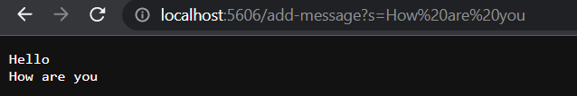

# Lab Report 2

## Part 1: Web Server

The code block below is the code for ```StringServer```.

```
import java.io.IOException;
import java.net.URI;

class Handler implements URLHandler {

    String s;

    public String handleRequest(URI url) {
        if(url.getPath().contains("/add-message")) {
            System.out.println("Path: " + url.getPath());
            String[] parameters = url.getQuery().split("=");
            
            String finalS;
            if(s != null) {
                finalS = s + "\n" + parameters[1];
                return finalS;
            }
            s = parameters[1];
            return s;

        }
        else
        return "404 Not Found!";
    }
}

public class StringServer {
    public static void main(String[] args) throws IOException {
        if(args.length == 0){
            System.out.println("Missing port number! Try any number between 1024 to 49151");
            return;
        }

        int port = Integer.parseInt(args[0]);

        Server.start(port, new Handler());
    }
}
```

The screenshots below are two uses of ```/add-message```.


* In the screenshot above, the methods in my code that are called are ```.getPath()``` ```.contains(Object object)``` ```.getQuery()``` and ```.split(String regex)```.
* The relevant argument to the ```.getPath()``` method is the ```URI url``` parameter passed through the handleRequest method.  The relevant argument to the ```.contains(Object object)``` method is the string "/add-message" which checks if the correct path gets typed to keep track of a string.  The ```.getQuery()``` method gets the string after the "?" in the URL instance named url. The ```.split(String regex)``` method takes in the string argument "=" to split up the query in order to get the running string which would be "Hello". 
* From this specific request, the value of the ```String s``` field would be changed to the running string which would be "Hello", as portrayed in the image above.




* In the screenshot above, the methods in my code that are called are the same as the methods in the image before.
* The relevant arguments to the methods are the same as before except for the ```.split(String regex)``` method takes in the string argument "=" to split up the query in order to get the running string which would be "How are you". 
* From this specific request, the value of the ```String s``` field would be changed from "Hello" to the running string "How are you".  Additionally, since the value of ```String s``` field is not null this time, the value of the ```String finalS``` field would also be changed to the value of the s field concatenated with a new line and the running string, as noted by ```parameters[1]``` which is the second index of the ```parameters``` array which separates the query string by the "=" sign.


## Part 2: Bug Review


Choose one of the bugs from lab 3.

Provide:

* A failure-inducing input for the buggy program, as a JUnit test and any associated code (write it as a code block in Markdown)
* An input that doesn’t induce a failure, as a JUnit test and any associated code (write it as a code block in Markdown)
* The symptom, as the output of running the tests (provide it as a screenshot of running JUnit with at least the two inputs above)
* The bug, as the before-and-after code change required to fix it (as two code blocks in Markdown)

The bug chosen from lab 3 is the one found in the ```static double averageWithoutLowest(double[] arr)``` method.

* The failure-inducing input for the buggy program is shown below in the code block as a JUnit test.  The method is supposed to to return the average of numbers in an array of type ```double``` without including the lowest value in the array.  However, this input will result in a failure because all the elements in the array are the same value and does not return the correct average since the method does not detect that there is no lowest value since all the elements are the same.

JUnit test with failure-inducing input

```
@Test
  public void testAvgWOutLow5() {
    double[] doubleArr = {3.0, 3.0, 3.0, 3.0};
    double result = ArrayExamples.averageWithoutLowest(doubleArr);
    assertEquals(3.0, result, 0.0001);
  }
```

* The input shown in the code block below is a JUnit test that does not induce a failure.  It does not induce a failure because there is value that can be considered the lowest and all the elements in the array are of type ```double``` so these meet all the requirements for the method to work properly.
Note: The method will still work properly if an array of type ```double``` is passed and there are no elements.  If that happens, the result will be 0.0. The method will also work if there are only two elements of type ```double```, as long as if one element can be considered the lowest value.

JUnit test with proper input

```
@Test
  public void testAvgWOutLow2() {
    double[] doubleArr = {2.0, 3.0, 1.0, 4.0};
    double result = ArrayExamples.averageWithoutLowest(doubleArr);
    assertEquals(3.0, result, 0.0001);
  }
```

* The, symptom, otherwise known as the output of both the inputs previously explained and depicted above is shown as a screenshot below.  


Note: In order to run the JUnit tests in a VSCode terminal on a Windows OS machine, the following code blocks must be used, specifically for the ArraysTest.java file.

```
local $ javac -cp ".;lib/hamcrest-core-1.3.jar;lib/junit-4.13.2.jar" *.java
local $ java -cp ".;lib/junit-4.13.2.jar;lib/hamcrest-core-1.3.jar" org.junit.runner.JUnitCore ArrayTests
```

* The following code blocks below (1) show the method before the bug was fixed and (2) show the method after the bug was fixed.

Before the code was changed
```
static double averageWithoutLowest(double[] arr) {
    if(arr.length < 2) { return 0.0; }
    double lowest = arr[0];
    for(double num: arr) {
      if(num < lowest) { lowest = num; }
    }
    double sum = 0;
    for(double num: arr) {
      if(num != lowest) { sum += num; }
    }
    return sum / (arr.length - 1);
  }
```

After the code was changed
```
static double averageWithoutLowest(double[] arr) {
    if(arr.length < 2) { return 0.0; }
    double lowest = arr[0];
    for(double num: arr) {
      if(num < lowest) { lowest = num; }
    }
    double sum = 0;
    int count = 0;
    for(double num: arr) {
      if(num != lowest) { sum += num; }
      else if(num == lowest) { count++;}
    }
    if(count == arr.length) {
      double total = 0; 
      for(double num : arr) { total += num; }
      return total / arr.length;
    }
    return sum / (arr.length - 1);
  }
```

* The fix addresses the issue because the method now checks if the all the elements in the array are the same value as the lowest.  If that is true, then it takes the average of all the values since there is no lowest value.

## Part 3: Reflection
