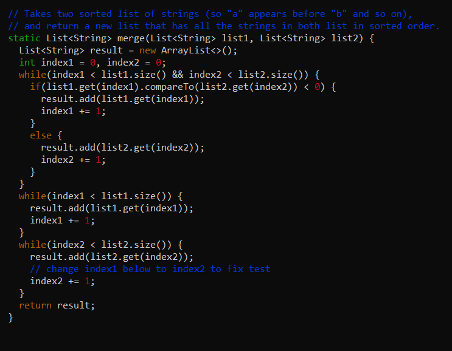

# Lab Report 4

## Command Line Tasks

>Note: Starting from step 4 of lab 7 command line tasks

Step 4: Log into ieng6

>Note: Use your UCSD course-specific ieng6 account and credentials.  In general, you will have to type ```cs15lsp23xx@ieng6.ucsd.edu``` with ```xx``` replaced with your specific account details.
>Note: You will be asked for your password if you have not created an SSH key for your ieng6 account.

The image below is when I have an SSH key generated for my ieng6 account so I am not asked for my password.


Keys pressed:
```cs15lsp23ph@ieng6.ucsd.edu``` ```<enter>``` to log in.

---

Step 5: Cloning fork of repository from my GitHub account


Keys pressed:
```git clone git@github.com:mdimapilis/lab7.git``` ```<enter>```

---

Step 6: Running tests (failing)


Keys pessed:
```cd lab7``` ```<enter>``` to change directory into lab7 repository to run tests
```javac -cp .:lib/hamcrest-core-1.3.jar:lib/junit-4.13.2.jar *.java``` ```<enter>``` to compile all java files in lab7 directory
```java -cp .:lib/hamcrest-core-1.3.jar:lib/junit-4.13.2.jar org.junit.runner.JUnitCore ListExamplesTests``` ```<enter>``` to show tests fail

---

Step 7: Editing ```ListExamples.java``` file


Keys pressed:

```vim ListExamples.java``` ```<enter>``` to enter visual mode to edit ListExamples.java


Keys pressed:

```/index1 +``` ```<enter>``` to find ```index1 +``` in the file. Cursor is at first ```index1 +``` in ```merge``` method so press arrow down key 14 times and right arrow key 3 times.


Keys pressed:

```i``` ```<enter>``` to enter insert mode and edit file



Keys pressed:

```<delete>``` ```2``` to edit ```index1``` in last while loop of ```merge``` method``` to ```index2```
```<esc>``` to leave insert mode and stop editing file


Keys pressed:
```:wq``` ```<enter>``` to exit vim and go back to terminal.
  
---

Step 8: Run tests (passed)


>Note: still in lab7 directory
>Note: you can use a number of up arrows to access ```javac -cp``` and ```java -cp``` since those commands were already typed before and are in the history.

  
Keys pressed:
```javac -cp .:lib/hamcrest-core-1.3.jar:lib/junit-4.13.2.jar *.java``` ```<enter>``` to compile all java files in lab7 directory
```java -cp .:lib/hamcrest-core-1.3.jar:lib/junit-4.13.2.jar org.junit.runner.JUnitCore ListExamplesTests``` ```<enter>``` to show tests pass after ```ListExamples.java``` has been edited.
  
---
  
Step 9: Commit and pushing to GitHub account


Keys pressed:
```git add .``` ```<enter>``` to add change in current working directory to staging area
```git commit -m "Updated"``` ```<enter>``` to save all changes


```git push``` ```<enter>``` to upload local repository to my GitHub repository that I cloned earlier.
