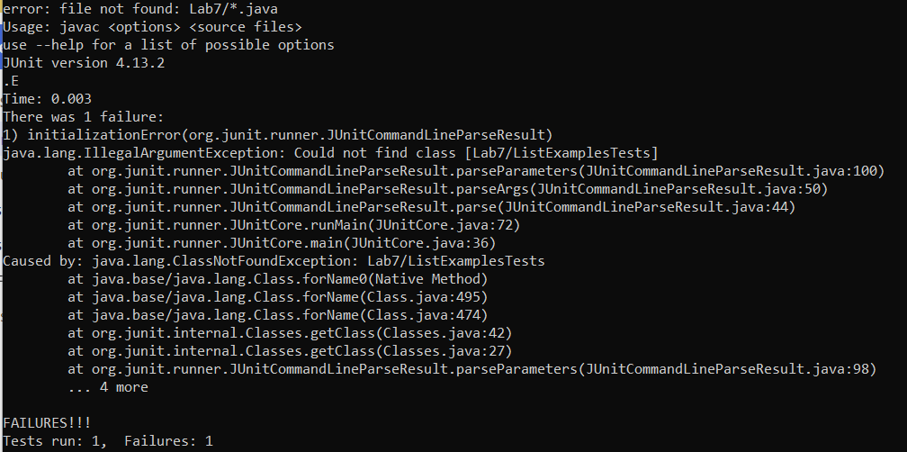
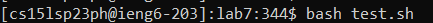
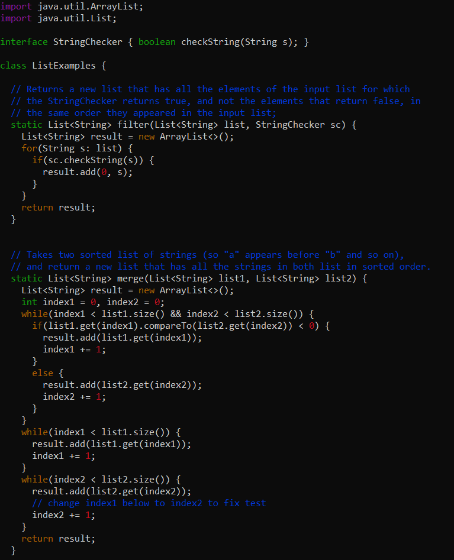
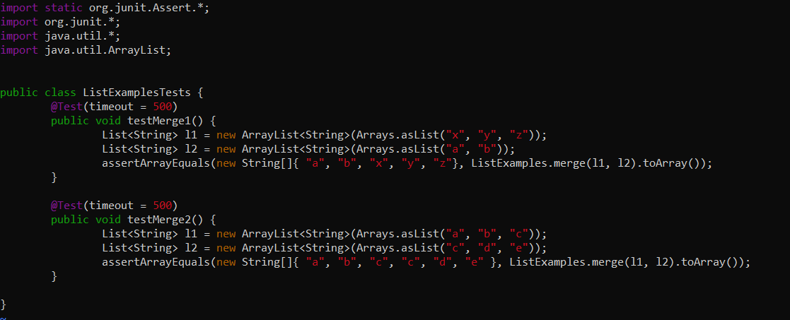
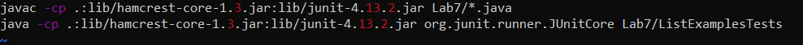
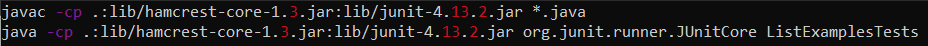
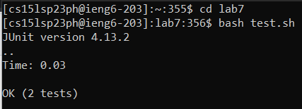

# Lab Report 5

## Part 1: Debugging Scenario

1. Original Student Post:

I am logged into my ssh ieng6 account via Command Prompt on my Windows 10 Dell XPS 15 7590.  

The symptom I am seeing is an initializationError, IllegalArgumentException, and ClassNotFoundException.  I am expecting to see output stating that my two tests passed for sorting and merging two pairs of lists.  The screenshot below is the symptom I am describing.

> Symptom



The failure-inducing input is typing in bash test.sh when I am in the lab7 directory. In the lab7 directory, there are ListExamples.java, ListExamplesTests.java, and test.sh files.  The screenshot below is the failure-inducing input that I am describing.  The screenshots below that is the files I listed previously.

> Failure-inducing input




> ListExamples.java in lab7 directory


> ListExamplesTests.java in lab7 directory


>test.sh in lab7 directory



2. TA Response:

Hi, I have looked at all your screenshots and files and have noticed that everything in your ListExamples.java and ListExamplesTests.java seem to be fine.  However, the code in your test bash script seems to be incorrect.  In the compilation of the java file, you made a call to all the files in the ```Lab7``` directory as noted by the ```Lab7/*.java``` in line 1 of test.sh.  You also made the same mistake in line 2 of your test bash script where you tried to run ListExamplesTests under ```Lab7``` as noted by the ```Lab7/ListExamplesTests``` in line 2.  For your mistake in line 1, I recommend deleting the ```Lab7/``` and instead just compile all the java files by only typing ```*.java``` after the compilation template code.  For your mistake in line 2, I suggest deleting the ```Lab7/``` and instead just run ```ListExamplesTests```.  Then, in your terminal, try changing the directory into ```lab7``` and run the command ```bash test.sh```.  Try out these suggestions that can fix your bug.


4. Student using TA feedback:

The screenshots below are showing the student using the feedback from the TA above. 

> Fixed test.sh using TA feedback



> Expected output
> Changed directory into lab7 and ran test.sh using bash




As determined by taking the feedback and screenshots above, the bug was in the test.sh file where I was incorrectly using it to compile and run ListTestExamples.java  The feedback from the TA fixed the bug.


## Part 2: Reflection

From my lab experience in the second half of this quarter, I did not know that you could edit java files via the terminal using vim.  I found that to be very cool since you do not even need an IDE to edit or even run the files.  The commands for vim are very useful for being to able to view and edit files.

